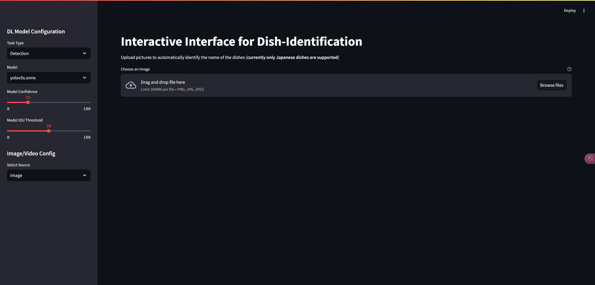

# 基于YOLOv5的菜品识别

## brief

基于 YOLOv5 的菜品识别项目，具有前端交互界面。数据集使用`UECFOOD100`，模型采用`YOLOv5s`。

数据集链接: https://pan.baidu.com/s/170r2dPMxKutDT6YLdvJWSQ?pwd=umgx 提取码: umgx

预处理过的数据集链接: https://pan.baidu.com/s/1gxXj70mo5_ijvVRdo7z46g?pwd=fqxc 提取码: fqxc

**项目结构：**

```bash
DISH_RECO
│  app.py						前端交互界面
│  config.py				项目配置相关
│  inference.py			构建模型并推理
│  preprocess.py		对数据集进行预处理
│  README.md				说明文件
│
├─assets						其他资源
├─model							训练好的模型
└─test							测试文件
```

# env

使用python3.9和anaconda的虚拟环境，除YOLOv5所需的软件包以外，还需以下包：

- onnxruntime
- streamlit
- opencv-python-headless

## run

安装完YOLOv5和上述依赖后，进入项目根目录直接运行即可：

```bash
streamlit run ./app.py
```

网页侧边栏可以选择任务类型（目前只有物体识别）、模型以及图像源（图片或者视频流），同时可以调节模型置信度和IOU阈值。如下图：



